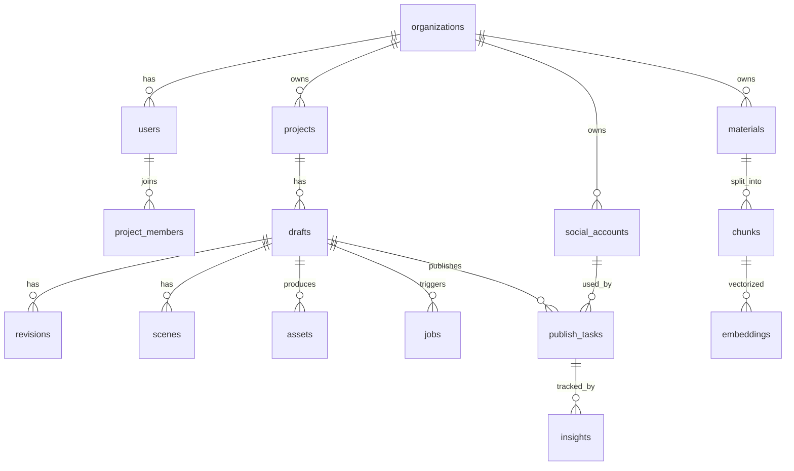

# 06 · 数据模型与数据库设计

数据库主存储：**PostgreSQL 16 + pgvector**。所有业务表带 `org_id` 实现多租户行级隔离（启用 RLS）。下面给出核心表的最小可用 Schema。

> 类型说明：`uuid` 默认 `gen_random_uuid()`；时间统一 `timestamptz`，默认 `now()`；JSON 字段全部使用 `jsonb`。

## 6.1 ER 图（Mermaid）



## 6.2 核心表 DDL（节选）

### organizations / users / membership

```sql
create table organizations (
  id           uuid primary key default gen_random_uuid(),
  name         text not null,
  plan         text not null default 'free',         -- free|creator|team|enterprise
  quota        jsonb not null default '{}',          -- {video_per_month, gpu_seconds, ...}
  settings     jsonb not null default '{}',
  created_at   timestamptz not null default now()
);

create table users (
  id           uuid primary key default gen_random_uuid(),
  email        citext unique,
  phone        text unique,
  name         text,
  avatar_url   text,
  password_hash text,
  locale       text not null default 'zh-CN',
  created_at   timestamptz not null default now()
);

create table memberships (
  org_id  uuid references organizations(id) on delete cascade,
  user_id uuid references users(id) on delete cascade,
  role    text not null check (role in ('owner','admin','editor','viewer')),
  primary key (org_id, user_id)
);
```

### materials / chunks / embeddings

```sql
create table materials (
  id          uuid primary key default gen_random_uuid(),
  org_id      uuid not null references organizations(id) on delete cascade,
  source_type text not null,            -- url|pdf|docx|md|txt|rss
  source_uri  text,
  title       text,
  raw_text    text,                     -- 清洗后的全文
  outline     jsonb,                    -- 章节树
  language    text,
  word_count  int,
  meta        jsonb not null default '{}',
  status      text not null default 'ready',
  created_at  timestamptz not null default now()
);
create index on materials (org_id, created_at desc);

create table chunks (
  id           uuid primary key default gen_random_uuid(),
  material_id  uuid not null references materials(id) on delete cascade,
  org_id       uuid not null,
  idx          int  not null,
  text         text not null,
  tokens       int,
  section_path text,                   -- "第1章/1.2 节"
  created_at   timestamptz not null default now()
);
create index on chunks (material_id, idx);

-- 向量列；维度按所选 embedding 模型设定
create table embeddings (
  chunk_id  uuid primary key references chunks(id) on delete cascade,
  org_id    uuid not null,
  model     text not null,
  embedding vector(1024) not null
);
create index on embeddings using ivfflat (embedding vector_cosine_ops) with (lists=200);
```

### projects / drafts / revisions / scenes

```sql
create table projects (
  id          uuid primary key default gen_random_uuid(),
  org_id      uuid not null references organizations(id) on delete cascade,
  name        text not null,
  style_preset text,                   -- 风格预设 ID
  target_platforms text[] not null default '{}',
  meta        jsonb not null default '{}',
  created_by  uuid references users(id),
  created_at  timestamptz not null default now()
);

create table drafts (
  id            uuid primary key default gen_random_uuid(),
  project_id    uuid not null references projects(id) on delete cascade,
  org_id        uuid not null,
  material_id   uuid references materials(id),
  title         text,
  status        text not null default 'DRAFT_INIT',
  knowledge_card jsonb,                -- 阶段1输出
  topic         jsonb,                 -- 阶段2选定 topic
  script        jsonb,                 -- 阶段3 文案
  storyboard    jsonb,                 -- 阶段4 分镜
  cover_asset_id uuid,
  final_video_asset_id uuid,
  duration_ms   int,
  cost          jsonb not null default '{}', -- {tokens, images, video_seconds, tts_chars, usd_cents}
  created_at    timestamptz not null default now(),
  updated_at    timestamptz not null default now()
);
create index on drafts (project_id, created_at desc);
create index on drafts (org_id, status);

create table revisions (
  id        uuid primary key default gen_random_uuid(),
  draft_id  uuid not null references drafts(id) on delete cascade,
  org_id    uuid not null,
  number    int  not null,
  snapshot  jsonb not null,            -- 完整 draft 快照
  author_id uuid references users(id),
  created_at timestamptz not null default now(),
  unique (draft_id, number)
);

create table scenes (
  id           uuid primary key default gen_random_uuid(),
  draft_id     uuid not null references drafts(id) on delete cascade,
  org_id       uuid not null,
  idx          int  not null,
  duration_ms  int  not null,
  subtitle     text,
  voice_text   text,
  visual_prompt text,
  asset_strategy text,                -- image|video|stock|user
  image_asset_id uuid,
  video_asset_id uuid,
  audio_asset_id uuid,
  meta         jsonb not null default '{}'
);
```

### assets

```sql
create table assets (
  id          uuid primary key default gen_random_uuid(),
  org_id      uuid not null,
  draft_id    uuid references drafts(id) on delete set null,
  scene_id    uuid references scenes(id) on delete set null,
  kind        text not null,             -- image|video|audio|subtitle|cover|final
  storage_url text not null,             -- s3://...
  width       int,
  height      int,
  duration_ms int,
  bytes       bigint,
  mime        text,
  model       text,                      -- 生成模型
  prompt      text,
  seed        bigint,
  meta        jsonb not null default '{}',
  created_at  timestamptz not null default now()
);
```

### jobs（流水线任务）

```sql
create table jobs (
  id          uuid primary key default gen_random_uuid(),
  org_id      uuid not null,
  draft_id    uuid references drafts(id) on delete cascade,
  pipeline    text not null,           -- understand|ideate|script|storyboard|image|video|tts|render|moderate|publish
  stage       text not null,           -- 同 pipeline 或子阶段
  status      text not null,           -- queued|running|succeeded|failed|cancelled
  attempt     int  not null default 0,
  input       jsonb,
  output      jsonb,
  error       jsonb,
  cost        jsonb not null default '{}',
  worker      text,
  started_at  timestamptz,
  finished_at timestamptz,
  created_at  timestamptz not null default now()
);
create index on jobs (draft_id, created_at);
create index on jobs (status, pipeline);
```

### social_accounts / publish_tasks / insights

```sql
create table social_accounts (
  id          uuid primary key default gen_random_uuid(),
  org_id      uuid not null,
  platform    text not null,           -- douyin|xhs|wechat_channels|bilibili|youtube|tiktok|x
  external_id text,                    -- 平台账号ID
  display_name text,
  auth        jsonb not null,          -- token / cookie / 设备指纹（加密存储）
  status      text not null default 'active',
  meta        jsonb not null default '{}',
  created_at  timestamptz not null default now(),
  unique (org_id, platform, external_id)
);

create table publish_tasks (
  id            uuid primary key default gen_random_uuid(),
  org_id        uuid not null,
  draft_id      uuid not null references drafts(id) on delete cascade,
  account_id    uuid not null references social_accounts(id),
  scheduled_at  timestamptz,
  status        text not null default 'pending',  -- pending|running|published|failed
  platform_video_id text,
  platform_url  text,
  caption       text,
  hashtags      text[],
  attempt       int not null default 0,
  error         jsonb,
  created_at    timestamptz not null default now(),
  published_at  timestamptz
);

create table insights (
  id              uuid primary key default gen_random_uuid(),
  publish_task_id uuid not null references publish_tasks(id) on delete cascade,
  org_id          uuid not null,
  collected_at    timestamptz not null default now(),
  views           bigint default 0,
  likes           bigint default 0,
  comments        bigint default 0,
  shares          bigint default 0,
  followers_gain  bigint default 0,
  ctr             real,
  retention       real,
  raw             jsonb
);
```

### prompts / styles / models

```sql
create table prompt_templates (
  id         uuid primary key default gen_random_uuid(),
  key        text not null,            -- e.g. script.douyin
  version    text not null,            -- v3
  locale     text not null default 'zh-CN',
  org_id     uuid,                     -- null=全局；非空=租户私有覆盖
  body       jsonb not null,           -- 模板正文 + 变量
  enabled    boolean not null default true,
  created_at timestamptz not null default now(),
  unique (key, version, locale, org_id)
);

create table style_presets (
  id        uuid primary key default gen_random_uuid(),
  org_id    uuid,                       -- null=系统预设
  name      text not null,
  preview_url text,
  config    jsonb not null,             -- 视觉风格、字幕样式、转场、BGM 偏好
  created_at timestamptz not null default now()
);

create table model_routes (
  id        uuid primary key default gen_random_uuid(),
  task      text not null,              -- llm.script | image.cover | video.scene | tts ...
  rules     jsonb not null,             -- 路由规则 (优先级数组)
  enabled   boolean not null default true,
  updated_at timestamptz not null default now()
);
```

### billing

```sql
create table usage_events (
  id          uuid primary key default gen_random_uuid(),
  org_id      uuid not null,
  user_id     uuid,
  draft_id    uuid,
  job_id      uuid,
  resource    text not null,            -- llm_tokens | image | video_seconds | tts_chars | render_seconds
  model       text,
  qty         numeric not null,
  unit_cost   numeric,                  -- 内部成本(分/单位)
  bill_cost   numeric,                  -- 计费给用户(分/单位)
  occurred_at timestamptz not null default now()
);
create index on usage_events (org_id, occurred_at);

create table subscriptions (
  id        uuid primary key default gen_random_uuid(),
  org_id    uuid not null references organizations(id) on delete cascade,
  plan      text not null,
  status    text not null,              -- active|past_due|cancelled
  period_start timestamptz,
  period_end   timestamptz,
  meta      jsonb not null default '{}'
);
```

## 6.3 行级安全（RLS）

```sql
alter table drafts enable row level security;
create policy drafts_isolation on drafts
  using (org_id = current_setting('app.current_org_id')::uuid);
```

应用在每个请求中通过 `set local app.current_org_id = '...'` 注入当前租户。

## 6.4 对象存储约定

- Bucket：`selfmedia-prod-media`（线上）/ `selfmedia-dev-media`（开发）。
- Key 模板：`{org_id}/{yyyy}/{mm}/{dd}/{draft_id}/{kind}/{asset_id}.{ext}`
- 公开访问：仅成片 / 封面通过签名 URL（短时效）下发。
- 生命周期：中间产物 30 天自动归档；成品永久（按订阅级别可调）。

## 6.5 数据保留与删除

- 用户主动删除草稿 → 30 天软删 → 永久删除（含对象存储）。
- 注销账号 → 7 天冷静期 → 全量删除并审计留痕（合规需要）。
- GDPR / 个人信息保护法：提供"导出我的数据"接口。
